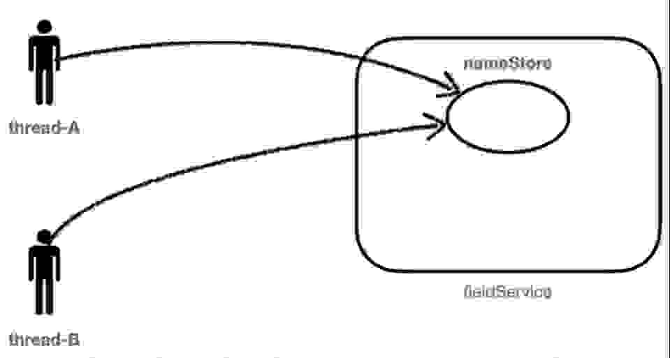

# 프로젝트명
  ###  -동시성이슈 관련 예제

   
  
   

## 프로젝트 소개

  ### 

  
  

 

## 기술 스택

| SpringBoot | MySQL |  Spring data JPA   |  PostMan   |  |
| :--------: | :--------: | :--------: | :--------: | :--------: |
|   ![sb]    |   ![my]    |   ![dj]    |   ![pos]    |       |

 

## 구현 기능

### 

 

## 배운 점.

  
 

 

## 라이센스

MIT &copy; [NoHack](mailto:lbjp114@gmail.com)

<!-- Stack Icon Refernces -->

[sb]: /images/stack/springboot.svg
[my]: /images/stack/mysql.svg
[dj]: /images/stack/datajpa.svg
[pos]: /images/stack/postman.svg
[jm]: /images/stack/apachejmeter.svg
