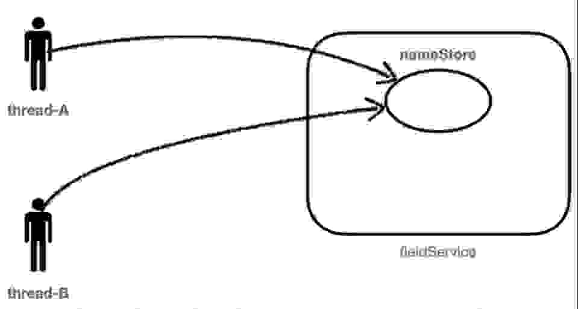

# 동시성 이슈 해결해보기

   
  
   

## 애플리케이션 소개

  <strong>동시성 이슈에 대해서 갱신누락이 되는 문제를 해결해봅시다.</strong>

 
 

## 배운 점 & 아쉬운 점

   1. synchronized 키워드는 하나의 프로세스 내부에서만 동작합니다. 서버를 여러대로 이용할경우 여전히 동시성 문제는 발생합니다.   
   2. DB단에서의 Lock인 PESSIMISTIC LOCK과 OPTIMISTIC LOCK이 존재합니다.  
      충돌이 빈번하다면 PESSIMISTIC, 그렇지않다면 OPTIMISITC 방법이 좋을것같습니다.  
   3. redis를 통해서도 분산락을 구현할수 있습니다. Lettuce와 Redisson을 사용하는 방법입니다.   
      Lettuce의 경우 spin lock구조이므로(RedisTemplate), redis에 부하가 있을수 있습니다. setnx로 키와 value를 넣는방식(setIfAbsent).  
      다만 Redisson방식은 "pub-sub방식"으로, 획득시점이 전달되고, timeout도 지정할수 있습니다. 그때 락 획득을 시도합니다.   
      단점으로는 직접 라이브러리를 추가 ,상대적으로 Lettuce에 비해서 redis에 부하가 덜 가게됩니다.   

 

## 라이센스

MIT &copy; [NoHack](mailto:lbjp114@gmail.com)

<!-- Stack Icon Refernces -->
